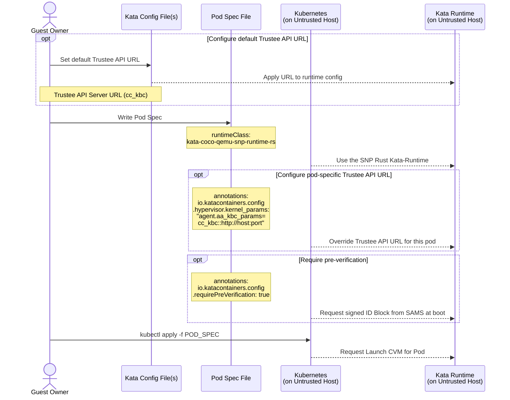
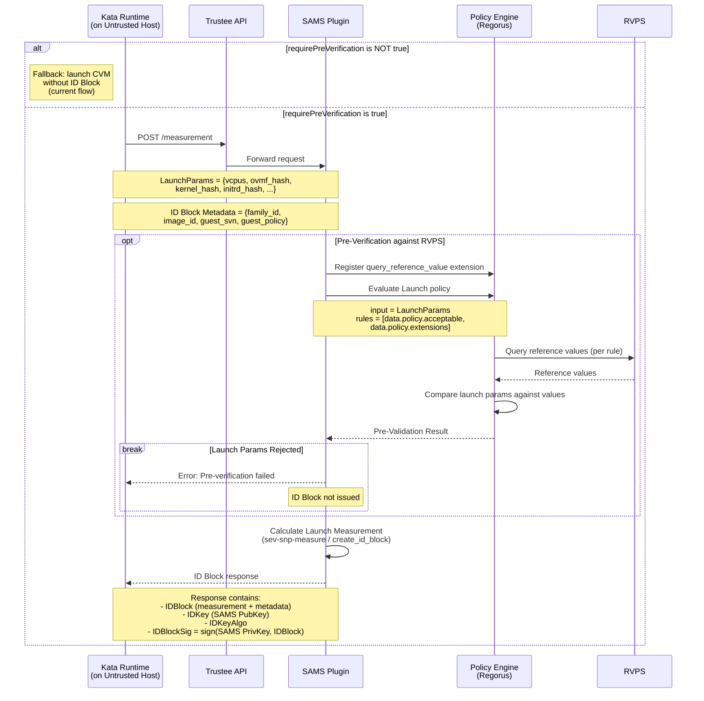
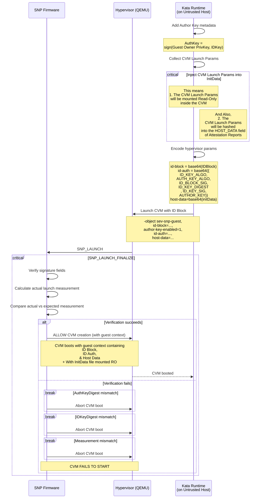
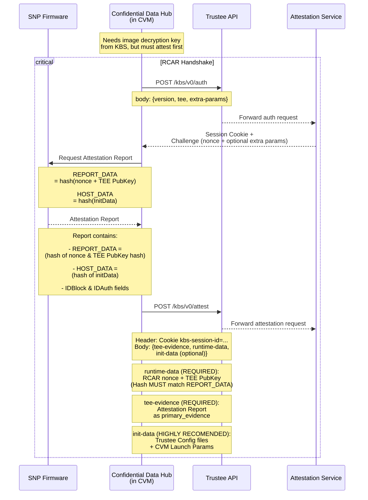
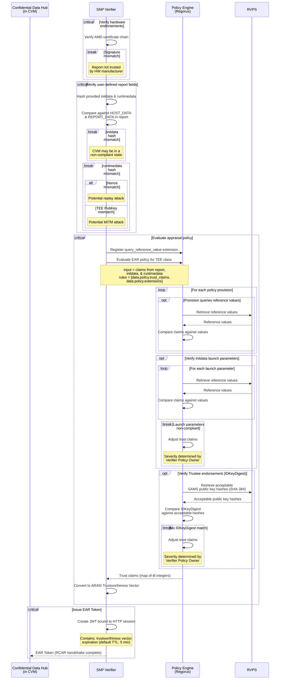
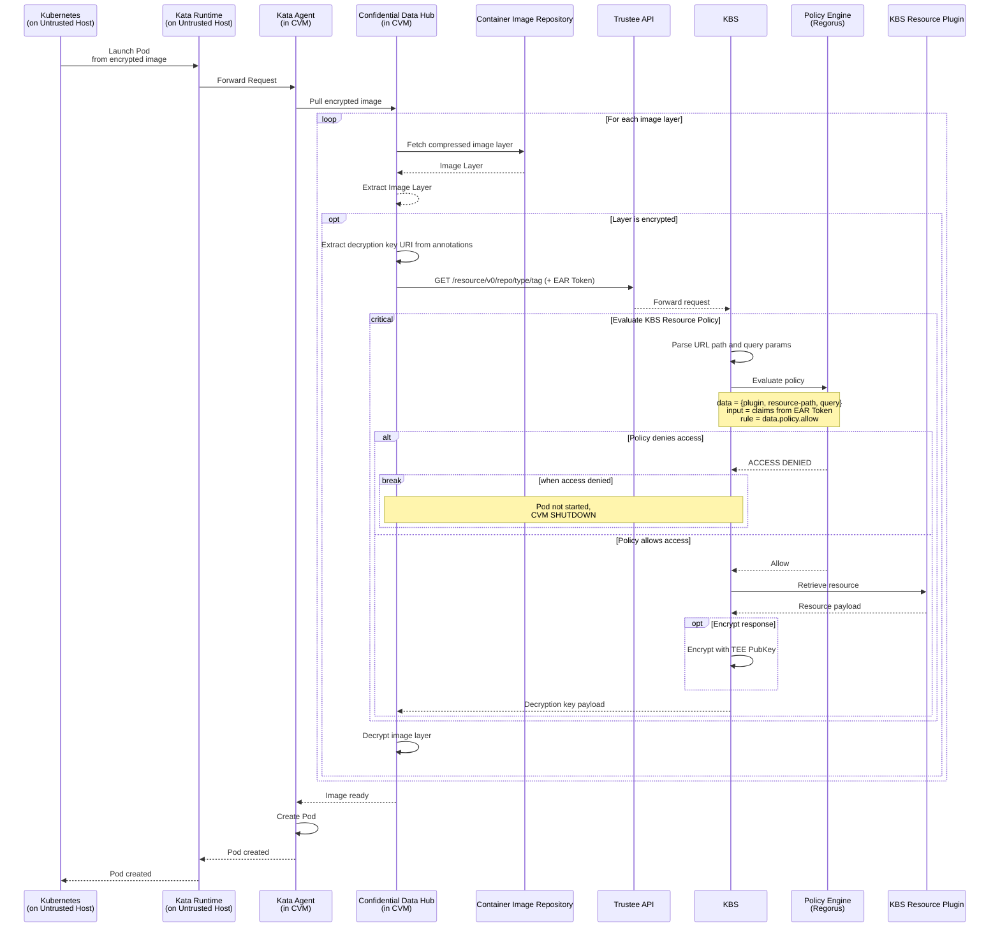

# Signing, Authorization, & Measurement Service (SAMS)

Background
---
Provides CVM-Launch-Measurement-as-a-Service funtionalities.

Why?
---
1. Offers verifiers AS STRONG a guarenteed that an attester launched with a specific configuration as does verifying the launch measurement in an attestation report against a list of reference values.
2. Makes Attestation Reports generated by Pre-Verified CVMs reflect an endorsement from Trustee
3. Facilitates the transition from storing and comparing opaque pre-computed launch measurements in RVPS to storing and comparing modular values for specific launch parameters

API
---
### POST /measurement
#### Requires Admin?
- No
#### Request Params:
- A JSON Object containing:
1. All params required to create an SNP Launch Measurement, EXCEPT for the Kernel, Initrd, & OVMF files
2. Precomputed measurements (cryptographic hashes) of the Kernel, Initrd, & OVMF
3. [Optional] The FAMILY_ID, IMAGE_ID, GUEST_SVN, GUEST_POLICY, & ID-BLOCK ABI VERSION being used to identify the CVM

#### Request Response Body:
- A JSON Object containing 5 fields:
1. A Launch Measurement constructed from the provided params & pre-computed measurements
2. A base64-encoded ID-Block structure generated from the Launch Measurement, fit to be passed into the hypervisor (qemu) when launching the CVM
3. ID_BLOCK_ALO - The signing algorithm used w/ the ID-Block & the ID_KEY to produce the ID_BLOCK_SIG
4. ID_BLOCK_SIG - The signature produced by running the ID-Block & the ID_PRIVATE_KEY (SAMS Private Key) through the ID_BLOCK_ALO algorithm
5. ID_KEY - The Public Key associated with (SAMS) which can be used to verify the ID_BLOCK_SIG

#### Expected usage:

##### SEV SNP ID-BLOCK Backend
The attestation flow using ID Block is broken into the following phases:

1. [Pod Configuration & Creation](#1-pod-configuration--creation)
2. [ID Block Generation via SAMS](#2-id-block-generation-via-sams)
3. [CVM Launch & Firmware Verification](#3-cvm-launch--firmware-verification)
4. [RCAR Handshake & Attestation Report](#4-rcar-handshake--attestation-report)
5. [Attestation Verification & Policy Evaluation](#5-attestation-verification--policy-evaluation)
6. [Secret Release & Pod Launch](#6-secret-release--pod-launch)

---

##### 1. Pod Configuration & Creation

The Guest Owner writes a Pod Spec selecting the SNP runtime class and optionally
enables pre-verification via SAMS. Kubernetes forwards the request to the Kata Runtime.



---

##### 2. ID Block Generation via SAMS

When `requirePreVerification` is true, Kata Runtime requests an ID Block from
the SAMS plugin. SAMS optionally pre-verifies each launch parameter against RVPS
reference values before computing the expected launch measurement and signing the
ID Block.

If `requirePreVerification` is not true, the current (non-SAMS) flow is used and
the CVM is launched without an ID Block.

> **TODO** Need to update `sev` crate to support creating `IdAuth` (IDBlock Signing Metadata) from provided `IDBlockSig`'s.
>> This facilitates allowing Kata-Runtime to Sign the IDKey provided by SAMS and set the Signature & AuthKey into the `IDAuth`

> **TODO** Need to update `sev` crate to verify `IDBlockSig` when provided an IDBlock & an IDKey (PubKey)
>> This facilitates allowing Kata-Runtime to confirm that the IDBlock, IDBlockSign, & IDKey SAMS returns actually match. 
>> Note: This check already happens in the SNP Firmware, but for completeness sake this functionality should also be exposed in the `sev` crate.

> **TODO** Need to update `sev` crate to be able to compute Launch Measurements when provided with KernelHashes, Initrd Hashes, & OVMF Hashes in addition to files.
>> This facilitates Kata-Runtime sending SAMS hashes instead of large files.



---

##### 3. CVM Launch & Firmware Verification

Kata Runtime adds the Guest Owner's Author Key, encodes the ID Block and
ID Auth structures, and passes them to the hypervisor. SNP firmware verifies
the signatures and compares the actual launch measurement against the expected
value in the ID Block.



---

##### 4. RCAR Handshake & Attestation Report

Once the CVM is running, the Confidential Data Hub (CDH) needs secrets (e.g. image
decryption keys) from the KBS. It performs the RCAR handshake in three steps: first,
it authenticates via `POST /kbs/v0/auth` and receives a session cookie and challenge
nonce. Next, it requests an attestation report from SNP firmware, binding the nonce
and TEE public key into REPORT_DATA and the initdata hash into HOST_DATA. The
resulting report also carries IDBlock and IDAuth fields. Finally, CDH submits the
report to `POST /kbs/v0/attest` with the tee-evidence (the attestation report),
runtime-data (the nonce and TEE public key whose hash must match REPORT_DATA),
and optionally init-data.



---

##### 5. Attestation Verification & Policy Evaluation

The SNP Verifier validates the attestation report in three stages: first, it verifies the
AMD certificate chain (hardware endorsement); second, it checks that the hashes of the
provided initdata and runtimedata match the HOST_DATA and REPORT_DATA fields in the report.
The verified claims are then evaluated by the Policy Engine against the EAR appraisal policy.
Policy provisions can query RVPS for reference values, optionally re-verify initdata launch
parameters, and verify the Trustee endorsement by comparing the IDKeyDigest against
acceptable SAMS public key hashes from RVPS. Any mismatch adjusts the trust claims at
a severity determined by the Verifier Policy Owner. The final result is an EAR token
encoding the TEE's trustworthiness vector.
> **TODO** Need to update `attestation_service::parse_init_data()` in the `trustee` crate to parse CVM Launch Params from the InitData

> **TODO:** `ear_default_policy_cpu.rego` needs to be updated to set the trustworthiness
> vector status to "warning" or "contraindicated" when launch parameter re-verification
> or Trustee endorsement verification fails.



---

##### 6. Secret Release & Pod Launch

The CDH presents the EAR token to request resources from the KBS. The KBS evaluates
the token against its resource policy; if allowed, the secret is released (optionally
encrypted with the TEE's public key). The CDH decrypts image layers and the pod launches.



### POST /launch-policy
#### Requires Admin?
- Yes
#### Request Params:
- A JSON Object containing:
 {"policy": "< base64-encoded rego policy >"}

#### Request Response Body:
- OK


#### Expected usage:

```shell
encoded_policy=$(base64 <<EOF
package policy
import rego.v1
default acceptable := true
EOF)
payload="$(jq --args policy "$encoded_policy" '{"policy": $policy}')"

kbs_host=localhost
kbs_api_port=8080
curl -X POST \
    -H "Content-Type: application/json" \
    -d "$payload" \
    http://$kbs_host:$kbs_api_port/kbs/v0/sams/launch-policy 
```
